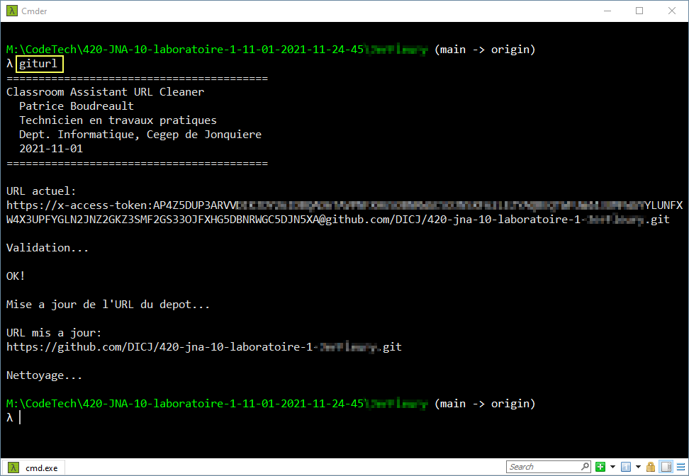

# Classroom Assistant URL Cleaner
**Patrice Boudreault**, Technicien en travaux pratiques, Département Informatique, Cégep de Jonquière

**2021-11-01**

## Problématique

Lorsque les enseignants utilisent le logiciel [GitHub Classroom Assistant](https://classroom.github.com/assistant) pour télécharger les devoirs des étudiants, le logiciel obtient une jeton d'authentification unique à accès restreint pour clôner le dépôt.

Ce jeton :
  * a une date d'expiration
  * ne permet PAS de faire des *push*

Les enseignants qui désirent créer une branche de correction et la *push* vers GitHub doivent donc manuellement exécuter une série de commandes pour modfier le *remote-url* du dépôt.

## Solution

Ce script automatise le nettoyage du *remote-url* du dépôt, pour enlever le jeton d'authentification unique.

Il remplace les tâches suivantes:

  * Affiche la liste des *remote*: `git remote -v`
  * Copier l'URL du dépôt
  * Coller l'URL du dépôt
  * Modifier l'URL du dépôt en supprimant tout ce qui se trouve entre https:// et github.com
  * Définir le nouvel URL comme *remote*: `git remote set-url origin [URL_Modifié]`

## Déploiement

  * Copier le script **giturl.bat** vers un dossier qui est référencé par la variable système **%PATH%**.

La commande **giturl** deviendra ainsi accessible depuis tous les dossiers sur votre ordinateur.

## Utilisation

En invite de commande (**cmd**), depuis un dossier clôné par l'application [GitHub Classroom Assistant](https://classroom.github.com/assistant), invoquer la commande suivante:

    
    giturl
    
### Particularités

Le script détecte la présence d'un **@** dans l'URL pour déterminer si il peut effectuer le nettoyage. S'il n'y en a pas, une erreur est affichée et aucun changement n'est effectué.

#### Mise en garde

Un **@** pourrait se trouver dans l'URL d'un dépôt clôné via une clé SSH, plutôt que via HTTPS.

Ce script ne tient pas compte de ce scénario, car le logiciel [GitHub Classroom Assistant](https://classroom.github.com/assistant) utilise toujours HTTPS pour clôner les dépôts.

### Capture d'écran
